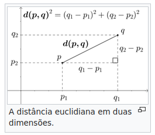
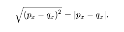
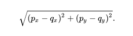
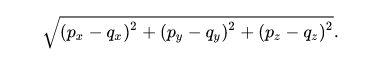
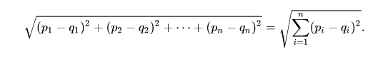

# Distância Euclidiana

Em matemática, distância euclidiana é a distância entre dois pontos, que pode ser provada pela aplicação repetida do teorema de Pitágoras. Aplicando essa fórmula como distância, o espaço euclidiano torna-se um espaço métrico. 

## Distância Unidimensional
Para pontos unidimensionais, P = (px) e Q = (qx), a distância é computada como: 

O valor absoluto é usado já que a distância é normalmente considerada um valor escalar sem sinal.

Veja o [código](https://github.com/LopesLs/EuclideanDistance/blob/main/EuclidianDistanceOneDimensional.py)

## Distância Bidimensional 

Para pontos bidimensionais, P = (px , py) e Q = (qx , qy), a distância é computada como: 

Veja o [código](https://github.com/LopesLs/EuclideanDistance/blob/main/EuclidianDistanceTwoDimensional.py)

## Distância Tridimensional
Para pontos tridimensionais, P = (px, py, pz) e Q = (qx, qy, qz), a distância é computada como: 

Veja o [código](https://github.com/LopesLs/EuclideanDistance/blob/main/EuclidianDistanceThreeDimensional.py)

## Distância N-Dimensional
Para pontos n-dimensionais, P = (p1, p2, ... , pn) e Q = (q1, q2, ..., qn), a distância é computada como:

Veja o [código](https://github.com/LopesLs/EuclideanDistance/blob/main/EuclidianDistanceNDimensional.py)